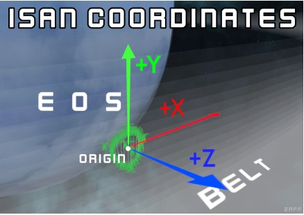
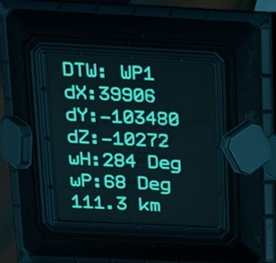
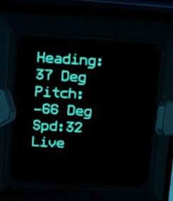

Version 3.5 - ISAN + Waypoint + Ship and Waypoint Heading - Updated to ISAN 2.5

## Added :spd variable to support speed being displayed in multiple places. Added support note for Streamers to obfuscate their location some and still use system.

This is the ISAN system from the Collective. 

It has been modified to work with my waypoint system and adding in heading and pitch for both ship and to waypoint.  The system will store up to 16 waypoints, cycle up and down (wrapping at the ends) and has an overwrite and home feature (goes to wp1).

"Pitch is your "vertical" angle from the Z axis with 0 being flat along the plane of the belt, and -90 and 90 being perpendicular.
Heading is your "horizontal" angle from the Z axis with 0 being along it pointing into the belt, 90 being along the X axis pointing "left" along the belt, and it wrapping back around to 360 pointing back into the belt"

# Getting Started
You can install all or part of this system. These instructions assume you are installing it all. The ISAN.yolol is the same as the one found on their github as of 8/17/21, except it has been modified for Mono mode accuracry (pr=1), speed indication (sp=1),memory chip storage of X, Y and Z, and support of heading and pitch system.  Do not use vanilla ISAN with this system.

#### Materials List for whole system
* Advanced YOLOL Chip - ISAN.yolol script - This is the ISAN script
* Advanded YOLOL Chip - WPDTW.yolol script - This is the Waypoint screen info script
* Advanced YOLOL Chip - ShipHeading.yolol script - This is the ships heading screen info script.
* Basic YOLOL Chip - WPIncrement.yolol script.
* (OPTIONAL) Basic YOLOL Chip - Deltas.yolol, needed if display of current deltas is desired.
* 3 YOLOL Memory Chips - One for storing `X`, `Y`, `Z` and current WP's `wX`, `wY`, `wZ`, current `wpnum`, and `spd`.  One for storing up to 10 waypoints. One for storing another 6 waypoints and variables needed for heading and pitch
* 4 Warning Buttons - Used for WP Increment, WP Decrement, WP Save, and WP Home Select. - IF YOU USE OTHER BUTTONS, the variable `wpb` must be on some device or memory chip.
* 4 24x24 Text Screens - One for ISAN, one for current deltas (OPTIONAL), one for Waypoint Info, one for Ship's heading, pitch, and speed.
* 1 progress bar (OPTIONAL) - Used to display current WP by the selectors.

#### Setup Instructions - Note: `wpb` is a critical field.  If you do not use warning buttons, you must create this field in memory chip 1.
1. Install all chips for desired level of system.  Be sure to bolt them in where appropriate.  Remember Memory chips only go in one way and can vanish if not inserted properly.  Recommend inserting memory chip, then yaw slightly on ship, see if its still in place.
2. Memory Chip 1.  On the chip, set the following fields: `X`, `Y`, `Z` to 0, `wx`, `wy`, `wz` to 1000, `wpc` to `"1000 1000 1000"` (quotes included), `wpnum` to 1, `spd` to 0. If not using warning buttons (see below) put `wpb` on this chip set to 0.  
3. Install Memory Chip 2.  On the chip, set the fields to: `wp1` to `wp10`.  Set the values to `"1000 1000 1000"` (quotes included) unless you have specific waypoints you want to put in. 
4. Install Memory Chip 3.  On it set fields `i`, `j`, `k` to 0, set fields `wp11` to `wp16` to `"1000 1000 1000"` (quotes included). 
5. Install the modified ISAN.yolol from here on an Advanced Chip.  Set up the receivers fields and data screen name (`_`) per https://isan.to/isan.pdf. The Waypoint system doesnt care if you are mono or quad mode.  If quad mode, you can set pr=0 in the script to turn off precision.  The isan.yolol in this folder is modified, do not use the vanilla version. (Display and Reciever fields should be updated as shown in the PDF) 
6. (OPTIONAL) Install Deltas.yolol on basic chip.  On a Text Screen, rename PanelValue field name to `Deltas`.  When moving, this will show your current delta X, Y and Z along with OPENING or CLOSING in reference to X, Y and Z to selected Waypoint.
7. Install WPDTW.yolol on an advanced chip.  On a text screen, rename PanelValue field name to `DTW`.  This will display Waypoint Number, Distance, WP Heading and WP Pitch, and delta X, Y, Z to it.   
8. Install ShipHeading.yolol on the third advanced chip.  On another text screen, renamed PanelValuye field to `Heading`  
9. Install WPIncrement.yolol on an basic chip. Install 4 warning buttons. Rename ButtonState field names to `wpi`, `wpd`, `wps`, `wph`.  (Increment, Decrement, Save, Home).  Rename all ButtonEnableBlink fields to `wpb`.  ButtonStyle should be 1.  ButtonColor is user preference, I use Red(0) for decrement, Green(2) for increment, Blue(3) for Save, and Orange(1) for Home.   Note: `wpb` is a critical field.  If you do not use warning buttons, you must create this field in memory chip 1.
10. (OPTIONAL) Install progress bar near warning buttons if needed to show currently selected waypoint. Name PanelValue to `wpnum`.  Minvalue 0, maxvalue 16.
11. (OPTIONAL) You can put SPD on any display you want to display just speed.  Currently displayed on ISAN panel and on Ships Heading panel.
12. (STREAMERS) You can put `_` on a memory chip or other non-display device and the entire system will work without the ISAN text display. THen you change the ISAN display from `_` to `Hello Snipers` or whatever. You can add `_` back to the ISAN text display when its ok for others to see your coordinates.

#### Usage Instructions - Note, if WPDTW.yolol is stuck on line 3, change the goto at the end to goto1 then back to goto3+c<0
1. During normal flight, the ISAN screen will show you current X, Y and Z and Speed.  The Deltas screen will show you your current X, Y and Z deltas based on current flight direction and speed along with XYZ OPENING or CLOSING to your current selected waypoint, IF MOVING. The DTW screen will show currently selected waypoint, distance to it, the WP Heading and Pitch to it, and delta X, Y and Z to it.  The Heading screen will show heading and pitch.  If it says Live at bottom, its updating, if it says Last Known, you are not moving so its the last reading it calculated.  Ships heading is stable AFTER flying in a straight line for a bit.
2. To fly to your waypoint: (recommend using combo of both methods)
    1. Method1: Use delta X/Y/Z shown on DTW screen and Deltas screen.  If DTW says you are dx: -500 then you would want the dx on the deltas screen to say a positive number.  Also if all 3 fields say CLOSING you are going in right general direction, but note the magnitudes of the deltas.  NOTE: This is the most accurate since if it says you are 500x off, you are 500x off.
    1. Method2: Use the WH and WP shown on the DTW screen.  Start flying VERY slowly (just need relative motion) till your Ships heading stops jumping around.  Then yaw till heading is close to WP Heading, then pitch till your ships pitch is close to WP Pitch.  Then you can accelerate to full speed.  Note:  These numbers do sometimes radically shift for a second due to transponder issues, fps issues, lag, etc.  Use the stable values.  I have twiced tested turning off station markets and flying back to my Origin from 40k in belt in fog with no idea which way to go first. Both times it got me home.
##### IMPORTANT: When using the Waypoint buttons, press them one time, wait for blinking to stop before pressing another.  DTW display will show PARSING WAYPIONT while its changing over.
3. To raise or lower current waypoint, press the Increment or Decrement warning button.  It wraps from 16 to 1 and 1 to 16.  Wait for blinking to stop and it's set.
4. To overwrite current waypoint, press the Save warning button.  You will get the same blinking and PARSING message.
5. To go to waypoint 1 press the Home warning button. (Saves time if you are on 5 for example).  Waypoint 1 is always considered home.

IF SOMETHING ISN'T WORKING - Recommend putting chips on a socket or chip reader insert so you can watch them run live and see where they are getting stuck, this will let me give better tech support.