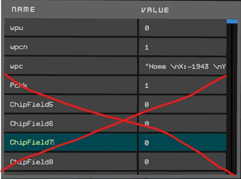

This is the ISAN system from the Collective, modified to work with my waypoint system.

# Getting Started
You can install all or part of this system.  The ISAN.yolol is the same as the one found at https://isan.to/isan.pdf except it has been modified for Mono mode accuracry (p0=0), speed indication (s0=0) and memory chip storage of X, Y and Z (change XX, YY, ZZ to :XX, :YY, :ZZ)

#### Materials List for whole system
* Advanced YOLOL Chip - ISAN.yolol script, can use basic if speed not desired (s0=1)
* Advanded YOLOL Chip - DTW.yolol script, needed for the use of sqrt and modulus(%).
* Basic YOLOL Chip - WPIncrement.yolol script, needed for use of modulus(%).
* (OPTIONAL) Basic YOLOL Chip - Deltas.yolol, needed if display of current deltas is desired.
* 2 YOLOL Memory Chips - One for storing XX, YY, ZZ and current WP X, Y, Z, and current WP Number.  One for storing up to 10 waypoints
* 4 Warning Buttons - Used for WP Increment, WP Decrement, WP Save, and WP Home Select.
* 3 24x24 Text Screens - One for ISAN, one for current deltas (OPTIONAL), one for Waypoint Info.
* 1 progress bar (OPTIONAL) - Used to display current WP by the selectors.

#### Setup Instructions - Note: wpb is a critical field.  If you do not use warning buttons, you must create this field in memory chip 1.
1. Install all chips for desired level of system.  Be sure to bolt them in where appropriate.  Remember Memory chips only go in one way and can vanish if not inserted properly.
2. Install Memory Chip 1.  On the chip, set the following fields: XX, YY, ZZ, wx, wy, wz, wpc, wpnum.  Set the value of wpc to "1 1 1"(this leaves 2 unused values) 
3. Install ISAN per https://isan.to/isan.pdf on an Advanced chip (basic if not using speed). The Waypoint system doesnt care if you are mono or quad mode, nor if you use speed or not.  If mono mode, recommend p0=0 to turn on precision.  You must change XX, YY and ZZ to :XX, :YY, :ZZ.  The isan.yolol in this folder is already modified. (Display and Reciever fields should be updated as shown in the PDF) 
4. (OPTIONAL) Install Deltas.yolol on basic chip.  On a Text Screen, rename PanelValue field name to Deltas.  When moving, this will show your current delta X, Y and Z. 
5. Install Memory Chip 2.  On the chip, set the fields to: wp1 to wp10.  Set the values to "1 1 1" unless you have specific waypoints you want to put in. 
6. Install DTW.yolol on an advanced chip.  On a text screen, rename PanelValue field name to DTW.  This will display Waypoint Number, Distance, and delta X, Y, Z to it. 
7. Install WPIncrement.yolol on an advanced chip. Install 4 warning buttons. Rename ButtonState field names to wpi, wpd, wps, wph.  (Increment, Decrement, Save, Home).  Rename all ButtonEnableBlink fields to wpb.  ButtonStyle should be 1.  ButtonColor is user preference, i use Red(0) for decrement, Green(2) for increment, Blue(3) for Save, and Orange(1) for Home. 
8. (OPTIONAL) Install progress bar near warning buttons if needed to show currently selected waypoint. Name PanelValue to wpnum.  Minvalue 0, maxvalue 10.

#### Usage Instructions - Note, if DTW.yolol is stuck on line 3, change the goto at the end to goto1 then back to goto3+c<0
1. During normal flight, the ISAN screen will show you current X, Y and Z and Speed if s0=0.  Note: ISAN speed is unreliable and generally low.  Usage is your choice.  The Deltas screen will show you your current X, Y and Z deltas based on current flight direction and speed.  (You can see what X, Y and Z are in the ISAN PDF).  The DTW screen will show currently selected waypoint, distance to it, and delta X, Y and Z to it.
2. To fly to your waypoint, if DTW says you are -500X you would want to fly plus X, etc.  No automation at this time.
##### IMPORTANT: When using the Waypoint buttons, press them one time, wait for blinking to stop before pressing another.  DTW display will show PARSING WAYPIONT while its changing over.
3. To raise or lower current waypoint, press the Increment or Decrement warning button.  It wraps from 10 to 1 and 1 to 10.  Wait for blinking to stop and its set.
4. To overwrite current waypoint, press the Save warning button.  You will get the same blinking and PARSING message.
5. To go to waypoint 1 press the Home warning button. (Saves time if you are on 5 for example).  Waypoint 1 is always considered home.
